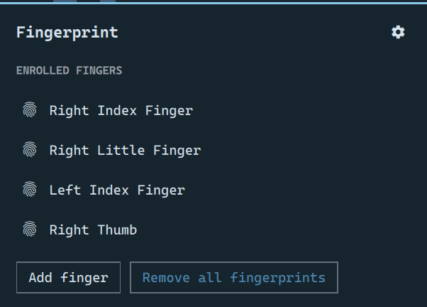
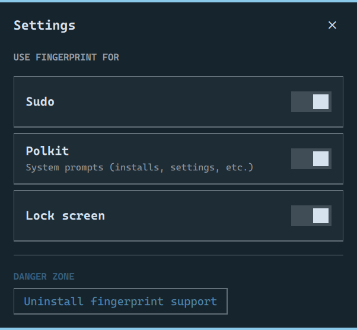

# Fingerprint Manager

An Omarchy panel for managing fingerprint authentication after it is set up: which fingers are
enrolled, adding and removing them, and which system tasks accept a fingerprint instead of a
password.



## Why

Omarchy can set fingerprint auth up — `Setup > Security > Fingerprint` runs
`omarchy-setup-security-fingerprint`, which installs the packages, enrolls one finger and wires
`pam_fprintd.so` into sudo, polkit and the lock screen. That script is a one-shot wizard, and it
is all there is. Afterwards there is no way to see what it did or change any part of it without
going back to a terminal:

- Enrolling a second finger means `fprintd-enroll` by hand, and knowing that fprintd names fingers
  `right-index-finger`, not "index".
- Turning fingerprint auth off for sudo but keeping it on the lock screen means editing
  `/etc/pam.d/sudo` as root and knowing which two lines the wizard added.
- Seeing which fingers are enrolled at all means `fprintd-list "$USER"`.
- The only supported "undo" is `omarchy-remove-security-fingerprint`, which removes *everything*,
  packages included.

That is a settings surface with no UI. This plugin is the UI: enrolled fingers with live
enrollment progress, and a switch per task, backed by the same PAM edits the wizard already makes.

It is backend-agnostic. Anything that implements the `net.reactivated.Fprint` D-Bus interface
works — stock `libfprint`/`fprintd`, or `open-fprintd` + `python-validity` for the Synaptics
readers `libfprint` has no driver for (Omarchy's own setup script learned to accept those in
[#8757](https://github.com/basecamp/omarchy/pull/8757)).

## Install

```bash
omarchy plugin add https://github.com/alhasapi/omarchy-fingerprint-manager.git --enable
~/.config/omarchy/plugins/alhasapi.fingerprint/bin/omarchy-fingerprint-install
```

The second command is not optional, and it is not something the plugin can do for itself. Omarchy
plugins have no post-install hook and no way to register a menu row, so that script does the two
things that have to happen outside the plugin directory:

1. Installs `/usr/share/polkit-1/actions/omarchy.fingerprint.toggle.policy` (asks for sudo). The
   per-task toggles edit root-owned files under `/etc/pam.d/`, so they run under `pkexec` against
   this action. Without it the toggles fail. The policy is generated from a template with your
   install's real path in `exec.path`, which is how polkit matches a `pkexec`'d binary to an
   action — so re-run this script if you ever move the plugin directory.
2. Adds a **Fingerprint Manager** row to `Setup > Security` in the Omarchy menu, by appending to
   `~/.config/omarchy/extensions/omarchy-menu.jsonc`. Comments in that file are preserved and
   re-running will not duplicate the row.

Then open it from `Setup > Security > Fingerprint Manager`.

### Keybinding

Optional, and the installer deliberately does not do it for you: the polkit action and the menu
row have no user-facing alternative, but a keybinding is a personal choice that can collide with
chords the installer cannot see.

**1. Edit `~/.config/hypr/bindings.lua`.** Omarchy ships this file with commented examples, and it
is the only place you should add bindings — the defaults live in
`/usr/share/omarchy/default/hypr/bindings/` and are replaced on every update. Add:

```lua
o.bind("SUPER + CTRL + ALT + F", "Fingerprint manager", "omarchy-shell shell toggle alhasapi.fingerprint")
```

**2. Reload.** `hyprctl reload` — no logout, no shell restart.

**3. Check it took:**

```bash
omarchy menu keybindings --print | grep -i fingerprint
```

It should also now be listed in the keybindings overlay on `SUPER + K`.

#### Choosing your own chord

`o.bind` takes the chord, the label shown in `SUPER + K` (pass `nil` for none), and the command:

```lua
o.bind("<chord>", "<Label>", "<command>")
```

Modifiers are `SUPER`, `CTRL`, `ALT` and `SHIFT`, joined with ` + `. Keys are xkb keysym names,
which are not always the obvious spelling — Omarchy's own bindings file notes that the comma key is
`comma` and that `COMMA` silently does not match.

Three commands are useful here. `toggle` is the one you usually want:

| Command | Effect |
|---|---|
| `omarchy-shell shell toggle alhasapi.fingerprint` | Opens it, and closes it if it is already open |
| `omarchy-shell shell summon alhasapi.fingerprint` | Only ever opens it (what the menu row runs) |
| `omarchy-shell shell hide alhasapi.fingerprint` | Only ever closes it |

Confirm a chord is free before you take it. Hyprland does not reject or warn about a duplicate — it
runs **both** bindings on every press, so a collision looks like your binding working plus something
else happening for no reason:

```bash
omarchy menu keybindings --print | grep -i "ALT + F"
```

Note the format that listing prints: modifiers are space-separated and only the final key gets a
`+`, so the binding above appears as `SUPER CTRL ALT + F` and grepping for `CTRL + ALT + F` finds
nothing.

To take a chord that is already bound, unbind it first in the same file:

```lua
hl.unbind("SUPER + CTRL + F")
o.bind("SUPER + CTRL + F", "Fingerprint manager", "omarchy-shell shell toggle alhasapi.fingerprint")
```

**Why `SUPER + CTRL + ALT + F` and not something shorter.** Omarchy puts shell panels on
`SUPER + CTRL + <letter>` — Audio is `+A`, Bluetooth `+B`, Network `+W`, Power `+P`. F is not
available there: `SUPER + F`, `SUPER + CTRL + F` and `SUPER + ALT + F` are all tiling bindings, and
both SHIFT variants open the file manager. The Calendar panel hits the same wall (`SUPER + CTRL + D`
is Display) and resolves it with `SUPER + CTRL + ALT + D`, so this follows suit.

#### If the chord does nothing

Run the command in a terminal. If it works there, the binding is the problem — re-check step 3, and
look for another binding on the same chord. If it fails there too with `plugin not enabled`, the
plugin is installed but not switched on:

```bash
omarchy plugin list
omarchy plugin enable alhasapi.fingerprint
```

It deliberately takes no bar slot. Every bar widget in Omarchy reports live state — battery
percentage, network status, container health. This one has nothing to report at a glance; it is a
settings screen, so it lives in the menu with the other Security entries.

To remove it:

```bash
omarchy plugin disable alhasapi.fingerprint
sudo rm /usr/share/polkit-1/actions/omarchy.fingerprint.toggle.policy
```

and delete the `setup.security.fingerprint-manager` row from your menu extensions file, plus the
keybinding if you added one.

## What it does

The panel decides between three states on every open, before it touches D-Bus:

| State | What you see |
|---|---|
| No reader detected | "No fingerprint reader detected." Nothing else — `omarchy-hw-fingerprint` found no device. |
| Reader, no backend | A **Set up fingerprint authentication** button that hands off to Omarchy's own wizard, then switches itself to the manager once the backend appears. |
| Backend present | Enrolled fingers, add/remove, and the settings screen behind the gear icon. |

**Enrolled fingers.** Lists them by name, with an **Add finger** flow that shows live per-scan
progress driven by fprintd's own `EnrollStatus` signal — the dots fill as the reader accepts each
of the device's enroll stages (five on the Synaptics `06cb:009a` this was written on), with the
retry hints fprintd emits ("Swipe more slowly", "Center your finger") shown as they arrive.

**Remove all fingerprints** is the only delete, and that is a limitation of the D-Bus API rather
than a shortcut: `net.reactivated.Fprint` has no per-finger delete at all. See
[docs/DESIGN.md](docs/DESIGN.md). To drop one finger, remove all and re-enroll the ones you keep.

**Use fingerprint for** — behind the gear icon — is a switch per task:



| Task | What toggling it changes |
|---|---|
| Sudo | `pam_fprintd.so` in `/etc/pam.d/sudo` |
| Polkit | `pam_fprintd.so` in `/etc/pam.d/polkit-1`, seeded from the vendor stack if absent |
| Lock screen | `/etc/pam.d/omarchy-lock-fingerprint`, the service file Omarchy's lock screen reads |

Each switch asks for authentication (`auth_admin_keep`), and the panel does not move it
optimistically — it re-reads the actual PAM files after `pkexec` exits, so a cancelled prompt
leaves the switch where it was. Edits made outside the panel are picked up too, through a
`FileView` watch on all three files.

**Uninstall fingerprint support**, in the danger zone, hands off to
`omarchy-remove-security-fingerprint` the same way setup does.

## Files

```
manifest.json                              Plugin manifest (id: alhasapi.fingerprint, kind: panel)
Panel.qml                                  The panel: window, three-state machine, manager UI
Model.js                                   Finger-name<->label map, event/result helpers
components/                                FingerRow, EnrollFlow, StagesIndicator, TaskToggleRow
bin/omarchy-fingerprint-install            Post-install: polkit action + menu row
bin/omarchy-fingerprint-setup-status       Hardware + backend presence -> JSON
bin/omarchy-fprintd-status                 Device + enrolled fingers -> JSON
bin/omarchy-fprintd-enroll <finger>        Streams EnrollStatus events as JSON lines
bin/omarchy-fprintd-delete-all             Deletes every enrolled finger for this user
bin/_fprintd_common.py                     Shared D-Bus glue for the three scripts above
bin/omarchy-fingerprint-toggle-status      Reads the 3 PAM files -> JSON on/off state
bin/omarchy-fingerprint-toggle <task> <on|off>   Root, via pkexec: edits the PAM files
polkit/omarchy.fingerprint.toggle.policy.in      Polkit action template (@TOGGLE_PATH@)
```

Every `bin/` script is runnable on its own and prints JSON, which is the whole debugging story —
see [docs/TESTING.md](docs/TESTING.md).

## Documentation

- [docs/DESIGN.md](docs/DESIGN.md) — why it is built this way: the three states, what needs root
  and what does not, why setup is delegated rather than reimplemented, why there is no per-finger
  delete, and the JSON contract between the scripts and the QML.
- [docs/TESTING.md](docs/TESTING.md) — how to verify a change, including the two traps that cost
  the most time: hot-reload that silently keeps running old code, and layout bugs that no amount
  of reading the QML will reveal.

## Credits

Panel and card chrome follow Omarchy's first-party plugins, MIT, © 37signals.

MIT.
